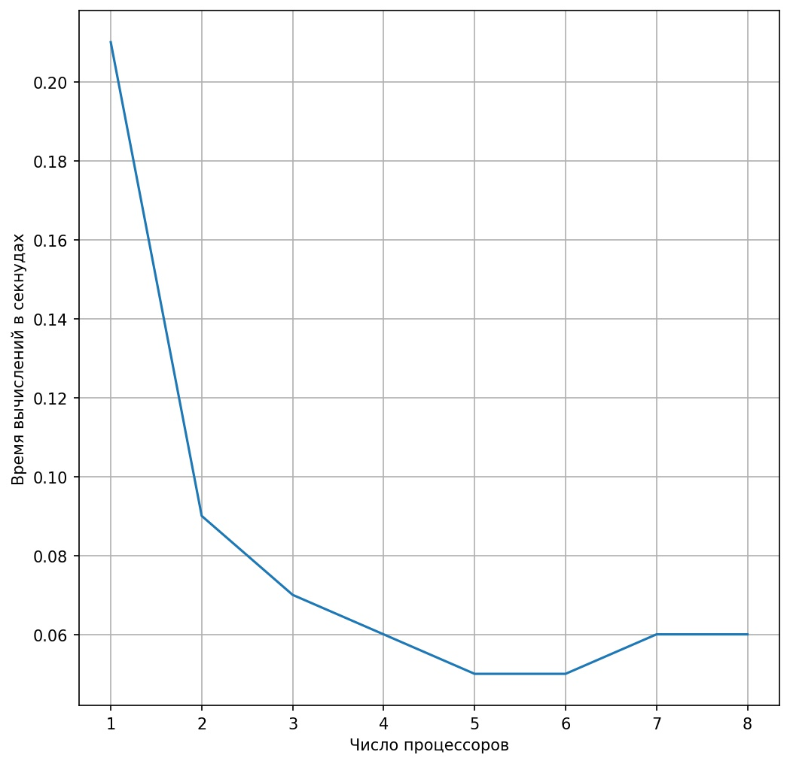
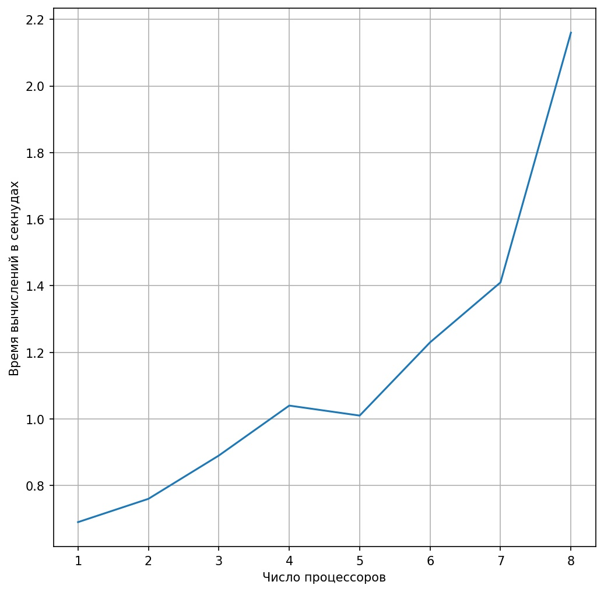

# Скорость работы в зависимости от числа процессов

[Время замерялось через скрипт на Bash](../scripts/meas_time.sh)

## При отсутствии постоянных синхронизаций для записи в файл

## При постоянных синхронизациях для сбора всего состояния на одном процессоре

Эффект от параллелизации сошёл на нет из-за постоянных операций Gather.

